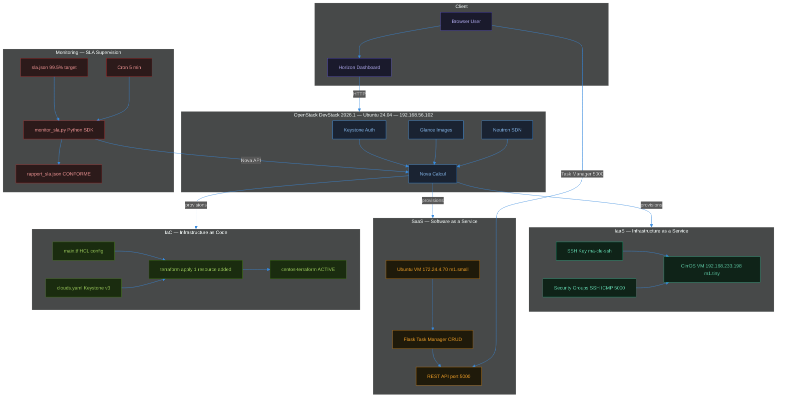
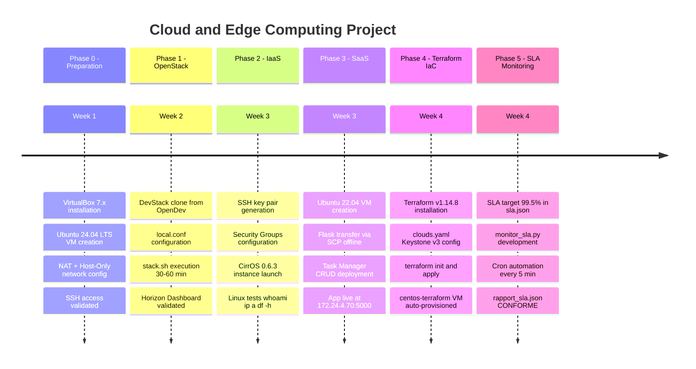
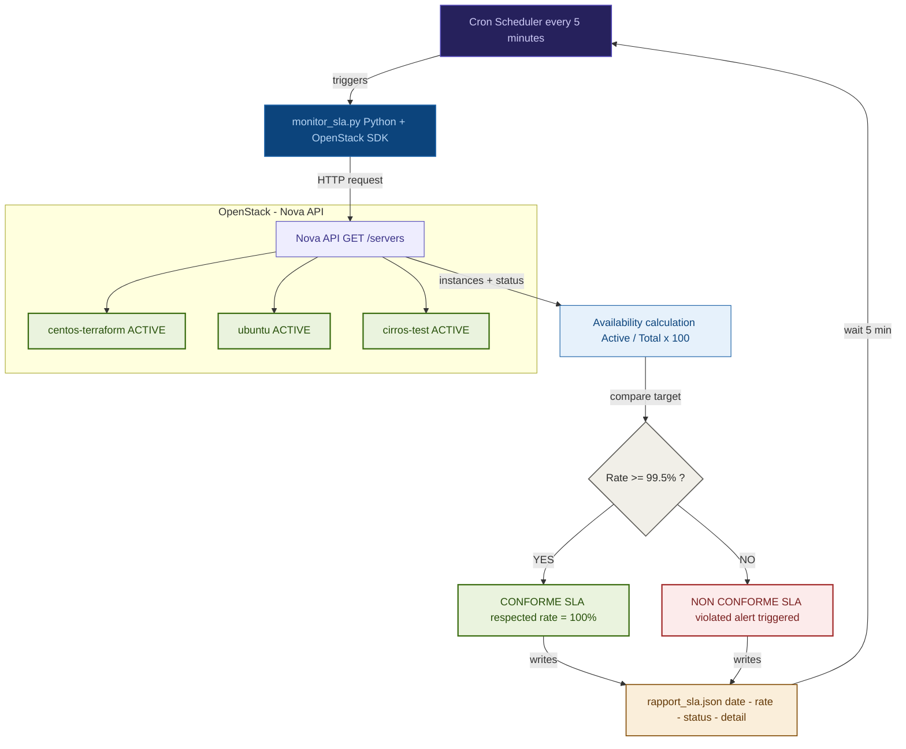

# Cloud & Edge Computing — OpenStack Infrastructure

> Private cloud infrastructure built from scratch on a personal PC — no AWS, no Azure, just open source.

**Stack:** OpenStack · Terraform · Python · Flask · VirtualBox · Linux · Cron · REST API

---

## Architecture Overview



---

## Project Phases



---

## SLA Monitoring Loop



---

## Project Structure

```
cloud-edge-computing-openstack/
├── README.md
├── diagrams/
│   ├── workflow.md
│   ├── architecture.md
│   ├── sla_boucle.md
│   └── timeline.md
├── code/
│   ├── main.tf
│   ├── monitor_sla.py
│   └── sla.json
└── rapport/
    └── Rapport.pdf
```

---

## Key Challenges Solved

- Flask offline installation via SCP without internet access inside OpenStack VM
- Terraform authentication with OpenStack resolved using `clouds.yaml`
- Nova compute stuck in "Powering On" — fixed via `virt_type=qemu` in nova config
- `br-ex` interface losing IP on reboot — fixed with persistent network configuration
- SLA monitoring integrated with Nova API using Python OpenStack SDK

---

## Author

**LAHLAIBI Ayoub** — Master SIT & Big Data, FST Tanger  
Université Abdelmalek Essaâdi
