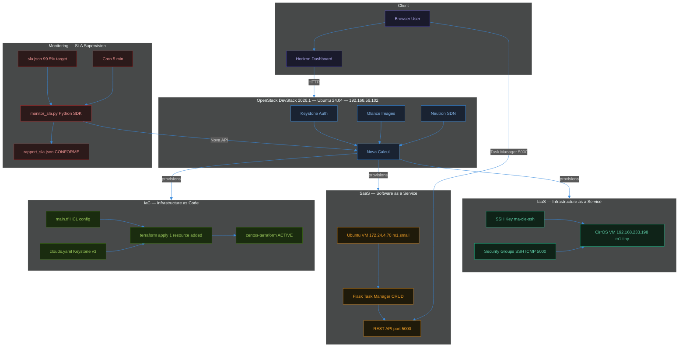

# Architecture Globale — OpenStack Private Cloud

```mermaid
%%{init: {"theme": "dark", "themeVariables": {"primaryColor": "#1A2332", "primaryTextColor": "#85B7EB", "primaryBorderColor": "#378ADD", "lineColor": "#378ADD", "secondaryColor": "#0D1117", "tertiaryColor": "#161B22", "fontSize": "13px"}}}%%

flowchart TB
  classDef core    fill:#1A2332,stroke:#378ADD,stroke-width:1px,color:#85B7EB
  classDef iaas    fill:#0F2318,stroke:#1D9E75,stroke-width:1px,color:#5DCAA5
  classDef saas    fill:#1F1A0A,stroke:#BA7517,stroke-width:1px,color:#EF9F27
  classDef iac     fill:#1A2C0F,stroke:#3B6D11,stroke-width:1px,color:#97C459
  classDef monitor fill:#2C1A1A,stroke:#A32D2D,stroke-width:1px,color:#F09595
  classDef client  fill:#1A1A2C,stroke:#534AB7,stroke-width:1px,color:#AFA9EC

  subgraph CLIENT["Client"]
    direction LR
    BR["Browser User"]:::client
    HZ["Horizon Dashboard"]:::client
    BR --> HZ
  end

  subgraph OPENSTACK["OpenStack DevStack 2026.1 — Ubuntu 24.04 — 192.168.56.102"]
    direction LR
    KS["Keystone Auth"]:::core
    GL["Glance Images"]:::core
    NV["Nova Calcul"]:::core
    NT["Neutron SDN"]:::core
    KS --> NV
    GL --> NV
    NT --> NV
  end

  subgraph IAAS["IaaS — Infrastructure as a Service"]
    direction LR
    CVM["CirrOS VM 192.168.233.198 m1.tiny"]:::iaas
    SGR["Security Groups SSH ICMP 5000"]:::iaas
    KEY["SSH Key ma-cle-ssh"]:::iaas
    KEY --> CVM
    SGR --> CVM
  end

  subgraph SAAS["SaaS — Software as a Service"]
    direction LR
    UVM["Ubuntu VM 172.24.4.70 m1.small"]:::saas
    FLK["Flask Task Manager CRUD"]:::saas
    API["REST API port 5000"]:::saas
    UVM --> FLK --> API
  end

  subgraph IAC["IaC — Infrastructure as Code"]
    direction LR
    MTF["main.tf HCL config"]:::iac
    CYM["clouds.yaml Keystone v3"]:::iac
    TFA["terraform apply 1 resource added"]:::iac
    CTO["centos-terraform ACTIVE"]:::iac
    MTF --> TFA
    CYM --> TFA
    TFA --> CTO
  end

  subgraph MONITORING["Monitoring — SLA Supervision"]
    direction LR
    SLJ["sla.json 99.5% target"]:::monitor
    MSL["monitor_sla.py Python SDK"]:::monitor
    CRN["Cron 5 min"]:::monitor
    RPT["rapport_sla.json CONFORME"]:::monitor
    SLJ --> MSL
    CRN --> MSL
    MSL --> RPT
  end

  HZ -->|HTTP| OPENSTACK
  NV -->|provisions| IAAS
  NV -->|provisions| SAAS
  NV -->|provisions| IAC
  MSL -->|Nova API| NV
  BR -->|Task Manager 5000| API
```
