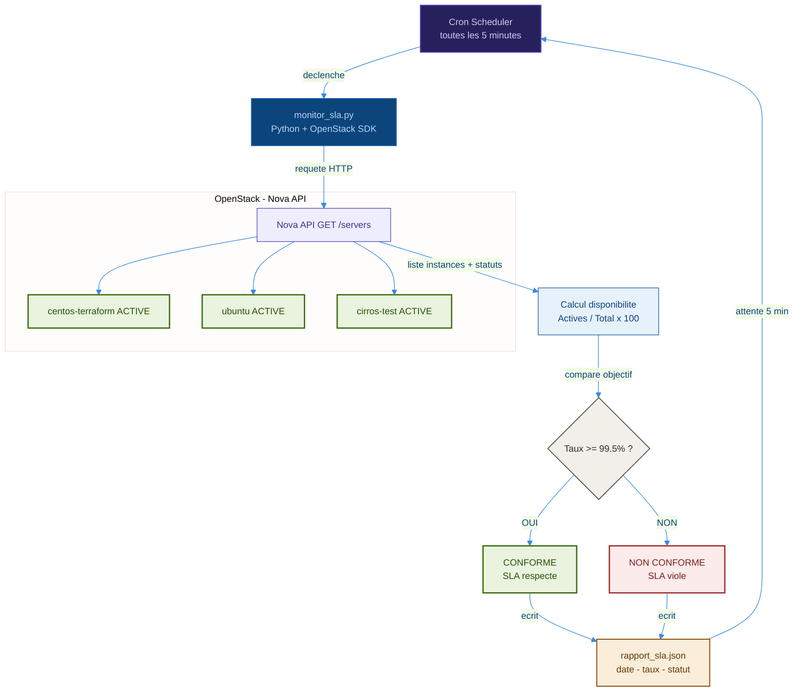

# SLA Monitoring Loop

```mermaid
%%{init: {"theme": "base", "themeVariables": {"primaryColor": "#E6F1FB", "primaryTextColor": "#0C447C", "primaryBorderColor": "#185FA5", "lineColor": "#378ADD", "fontSize": "14px"}}}%%

flowchart TB

  classDef cron    fill:#26215C,stroke:#534AB7,stroke-width:1.5px,color:#CECBF6
  classDef script  fill:#0C447C,stroke:#185FA5,stroke-width:1.5px,color:#B5D4F4
  classDef api     fill:#EEEDFE,stroke:#534AB7,stroke-width:1px,color:#3C3489
  classDef calcul  fill:#E6F1FB,stroke:#185FA5,stroke-width:1px,color:#0C447C
  classDef ok      fill:#EAF3DE,stroke:#3B6D11,stroke-width:2px,color:#27500A
  classDef nok     fill:#FCEBEB,stroke:#A32D2D,stroke-width:2px,color:#791F1F
  classDef rapport fill:#FAEEDA,stroke:#854F0B,stroke-width:1.5px,color:#633806
  classDef dec     fill:#F1EFE8,stroke:#5F5E5A,stroke-width:1.5px,color:#2C2C2A

  CRON["Cron Scheduler\ntoutes les 5 minutes"]:::cron
  CRON -->|declenche| SCRIPT
  SCRIPT["monitor_sla.py\nPython + OpenStack SDK"]:::script
  SCRIPT -->|requete HTTP| NOVA

  subgraph OPENSTACK["OpenStack - Nova API"]
    direction LR
    NOVA["Nova API GET /servers"]:::api
    VM1["centos-terraform ACTIVE"]:::ok
    VM2["ubuntu ACTIVE"]:::ok
    VM3["cirros-test ACTIVE"]:::ok
    NOVA --> VM1
    NOVA --> VM2
    NOVA --> VM3
  end

  NOVA -->|liste instances + statuts| CALCUL
  CALCUL["Calcul disponibilite\nActives / Total x 100"]:::calcul
  CALCUL -->|compare objectif| DECISION
  DECISION{"Taux >= 99.5% ?"}:::dec
  DECISION -->|OUI| CONFORME
  DECISION -->|NON| NONCONF
  CONFORME["CONFORME\nSLA respecte"]:::ok
  NONCONF["NON CONFORME\nSLA viole"]:::nok
  CONFORME -->|ecrit| RAPPORT
  NONCONF -->|ecrit| RAPPORT
  RAPPORT["rapport_sla.json\ndate - taux - statut"]:::rapport
  RAPPORT -->|attente 5 min| CRON
```
