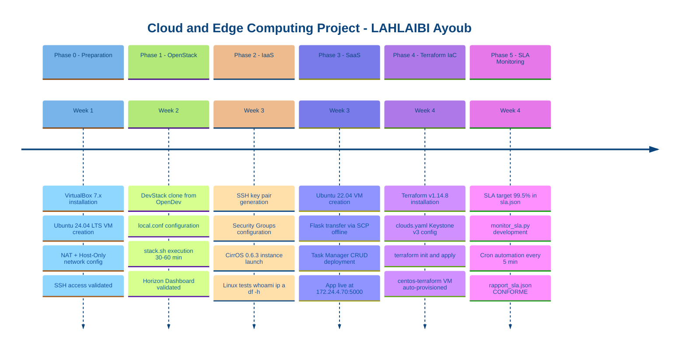

# Project Timeline

```mermaid
%%{init: {"theme": "base", "themeVariables": {"primaryColor": "#E6F1FB", "primaryTextColor": "#0C447C", "primaryBorderColor": "#185FA5", "lineColor": "#378ADD", "fontSize": "14px"}}}%%

timeline
  title Cloud and Edge Computing Project - LAHLAIBI Ayoub

  section Phase 0 - Preparation
    Week 1 : VirtualBox 7.x installation
           : Ubuntu 24.04 LTS VM creation
           : NAT + Host-Only network config
           : SSH access validated

  section Phase 1 - OpenStack
    Week 2 : DevStack clone from OpenDev
           : local.conf configuration
           : stack.sh execution 30-60 min
           : Horizon Dashboard validated

  section Phase 2 - IaaS
    Week 3 : SSH key pair generation
           : Security Groups configuration
           : CirrOS 0.6.3 instance launch
           : Linux tests whoami ip a df -h

  section Phase 3 - SaaS
    Week 3 : Ubuntu 22.04 VM creation
           : Flask transfer via SCP offline
           : Task Manager CRUD deployment
           : App live at 172.24.4.70:5000

  section Phase 4 - Terraform IaC
    Week 4 : Terraform v1.14.8 installation
           : clouds.yaml Keystone v3 config
           : terraform init and apply
           : centos-terraform VM auto-provisioned

  section Phase 5 - SLA Monitoring
    Week 4 : SLA target 99.5% in sla.json
           : monitor_sla.py development
           : Cron automation every 5 min
           : rapport_sla.json CONFORME
```
