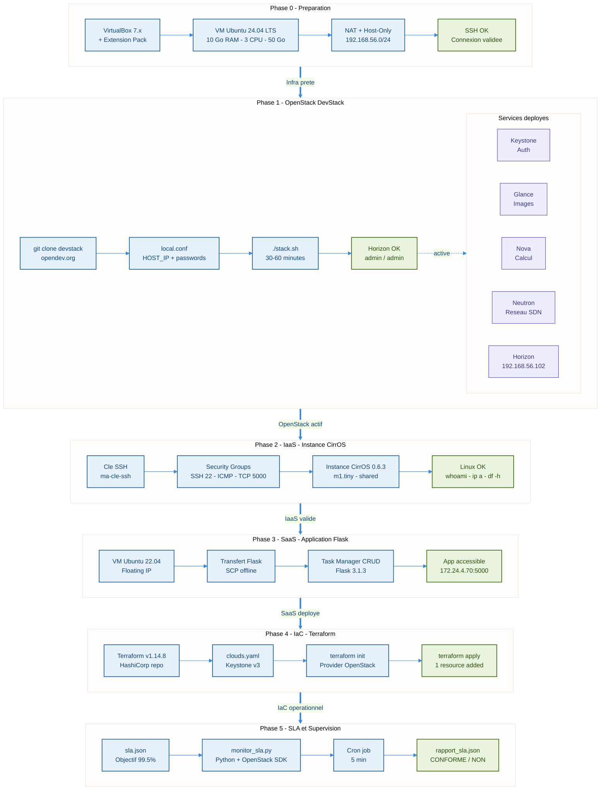

# Workflow — Cloud & Edge Computing Project

```mermaid
%%{init: {"theme": "base", "themeVariables": {"primaryColor": "#E6F1FB", "primaryTextColor": "#0C447C", "primaryBorderColor": "#185FA5", "lineColor": "#378ADD", "fontSize": "14px"}}}%%

flowchart TB

  classDef phase   fill:#E6F1FB,stroke:#185FA5,stroke-width:1.5px,color:#0C447C
  classDef success fill:#EAF3DE,stroke:#3B6D11,stroke-width:1.5px,color:#27500A
  classDef service fill:#EEEDFE,stroke:#534AB7,stroke-width:1px,color:#3C3489
  classDef script  fill:#26215C,stroke:#534AB7,stroke-width:1px,color:#CECBF6
  classDef report  fill:#085041,stroke:#0F6E56,stroke-width:1px,color:#9FE1CB
  classDef config  fill:#F1EFE8,stroke:#5F5E5A,stroke-width:1px,color:#444441
  classDef deliver fill:#FAEEDA,stroke:#854F0B,stroke-width:2px,color:#633806

  subgraph P0["Phase 0 - Preparation"]
    direction LR
    A1["VirtualBox 7.x\n+ Extension Pack"]:::phase
    A2["VM Ubuntu 24.04 LTS\n10 Go RAM - 3 CPU - 50 Go"]:::phase
    A3["NAT + Host-Only\n192.168.56.0/24"]:::phase
    A4["SSH OK\nConnexion validee"]:::success
    A1 --> A2 --> A3 --> A4
  end

  subgraph P1["Phase 1 - OpenStack DevStack"]
    direction LR
    B1["git clone devstack\nopendev.org"]:::phase
    B2["local.conf\nHOST_IP + passwords"]:::phase
    B3["./stack.sh\n30-60 minutes"]:::phase
    B4["Horizon OK\nadmin / admin"]:::success
    B1 --> B2 --> B3 --> B4
    subgraph SVC["Services deployes"]
      direction LR
      S1["Keystone\nAuth"]:::service
      S2["Glance\nImages"]:::service
      S3["Nova\nCalcul"]:::service
      S4["Neutron\nReseau SDN"]:::service
      S5["Horizon\n192.168.56.102"]:::service
    end
    B4 -.->|active| SVC
  end

  subgraph P2["Phase 2 - IaaS - Instance CirrOS"]
    direction LR
    C1["Cle SSH\nma-cle-ssh"]:::phase
    C2["Security Groups\nSSH 22 - ICMP - TCP 5000"]:::phase
    C3["Instance CirrOS 0.6.3\nm1.tiny - shared"]:::phase
    C4["Linux OK\nwhoami - ip a - df -h"]:::success
    C1 --> C2 --> C3 --> C4
  end

  subgraph P3["Phase 3 - SaaS - Application Flask"]
    direction LR
    D1["VM Ubuntu 22.04\nFloating IP"]:::phase
    D2["Transfert Flask\nSCP offline"]:::phase
    D3["Task Manager CRUD\nFlask 3.1.3"]:::phase
    D4["App accessible\n172.24.4.70:5000"]:::success
    D1 --> D2 --> D3 --> D4
  end

  subgraph P4["Phase 4 - IaC - Terraform"]
    direction LR
    E1["Terraform v1.14.8\nHashiCorp repo"]:::phase
    E2["clouds.yaml\nKeystone v3"]:::phase
    E3["terraform init\nProvider OpenStack"]:::phase
    E4["terraform apply\n1 resource added"]:::success
    E1 --> E2 --> E3 --> E4
  end

  subgraph P5["Phase 5 - SLA et Supervision"]
    direction LR
    F1["sla.json\nObjectif 99.5%"]:::phase
    F2["monitor_sla.py\nPython + OpenStack SDK"]:::phase
    F3["Cron job\n5 min"]:::phase
    F4["rapport_sla.json\nCONFORME / NON"]:::success
    F1 --> F2 --> F3 --> F4
  end

  P0 ==>|"Infra prete"| P1
  P1 ==>|"OpenStack actif"| P2
  P2 ==>|"IaaS valide"| P3
  P3 ==>|"SaaS deploye"| P4
  P4 ==>|"IaC operationnel"| P5
```
